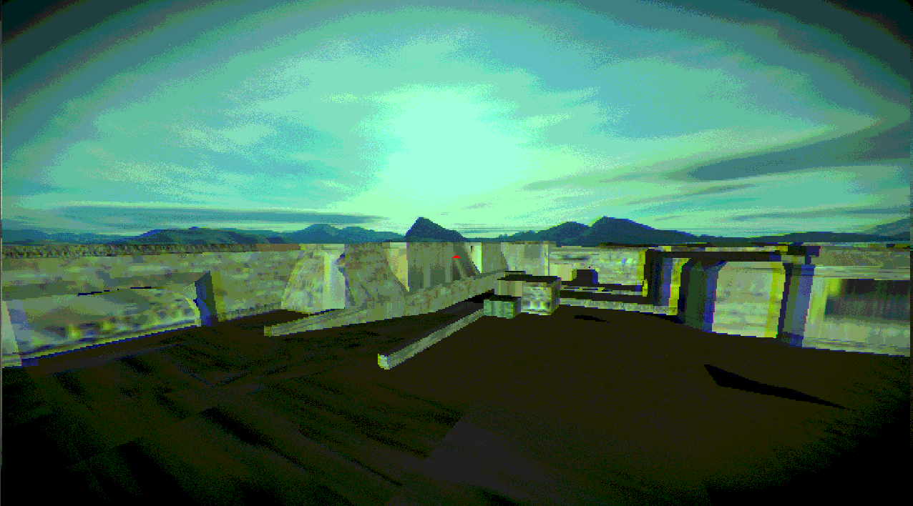

Engine development

A 3D first person shooter written in my own engine, developed entirely from scratch in C, only using a handful of low level dependencies (stb, glfw, glew).

The textures are stretched/distorted. This is not a problem with my code, I just failed to bake correctly in blender. I think it fits the style of the game though, so I will keep the textures distorted.

